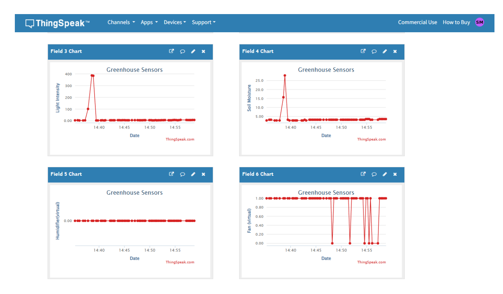
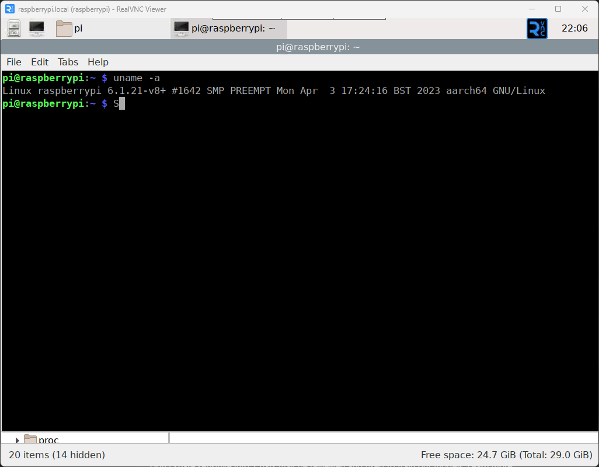
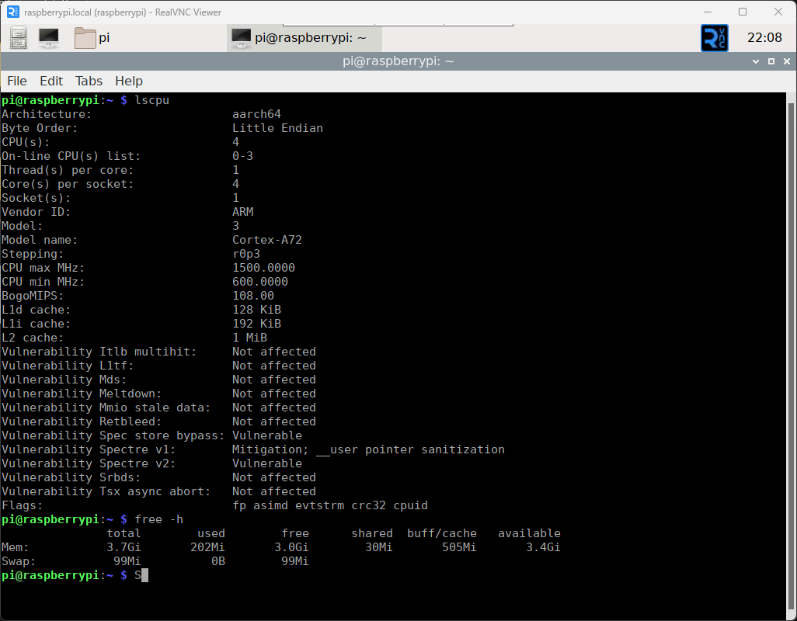

# fyp-edge_ml_controller_optimizer

# 🌱 Edge ML Controller Optimizer for Smart Irrigation

## 📌 Project Description

This project implements an **Edge Machine Learning–based smart irrigation system** using a Raspberry Pi. It leverages real-time sensor data and a **Random Forest model** to optimize water usage by predicting irrigation requirements.

The system operates fully on-device (edge), enabling **low-latency, offline decision-making** without reliance on cloud computation. It continuously monitors soil moisture, temperature, and humidity, and derives features such as **dry rate and time of day** to intelligently control irrigation.

The solution includes:
- Data collection module for training
- ML-based irrigation controller
- Pump calibration utility

This project demonstrates the integration of **IoT + Edge AI + Agriculture** to build an efficient and scalable smart farming solution.

---

## ⚙️ System Architecture

Sensors (Soil + DHT11)
↓
Raspberry Pi (Edge Device)
↓
Feature Engineering (Dry Rate, Time)
↓
Random Forest Models
↓
Decision Engine
↓
Pump + Fan Control (Relay)
↓
Cloud Logging (ThingSpeak)

---

## ThingSpeak Platform Dashboard of Real-Time Data Logging
<p align="center">
  
</p>


---

## 🧠 Machine Learning

- **Model:** Random Forest Regressor  
- **Inputs:**
  - Soil Moisture (%)
  - Temperature (°C)
  - Humidity (%)
  - Dry Rate
  - Time of Day  

- **Outputs:**
  - Pump Runtime (seconds)
  - Next Irrigation Time  

Refer to Random Forest training code from this repository
-  Irrigation Prediction (Random Forest Model)  
   [Irrigation Prediction Training Code](https://github.com/sriram-mahendran/fyp-irrigation_model_training)


---

## 🔌 Hardware Description

- Raspberry Pi (with GPIO support)
- Soil Moisture Sensor
- ADC Module (I2C, e.g., PCF8591)
- DHT11 Temperature & Humidity Sensor
- Relay Module
- Water Pump
- Fan
- Power Supply

---
---

##Raspberry Pi OS Specifications
<p align="center">
  
</p>

---
---
##Raspberry Pi Hardware Specifications
<p align="center">
  
</p>


---


---

## 🔧 Setup

### 1. Install Dependencies

```bash
pip install numpy joblib smbus adafruit-circuitpython-dht requests RPi.GPIO
```

---

